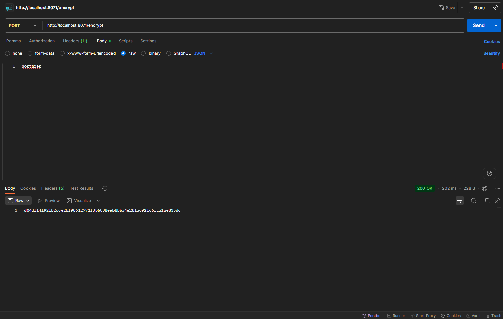

OPTIMA GROWTH MICROSERVICE SYSTEM (IN PROGRESS)
===============
Based on the book **Microservices in Action** by **John Carnell and Illary Sanchez**

You can buy the book on:
### [Amazon](https://a.co/d/eSzO7DP)

Chapter 5 - USING CONFIG SERVER WITH VAULT
===============

## How I Begin ( This is not the starting point of my reading )

### Introduction

Vault is a tool that allows you to create configurations for your application and store the secret environment variables such as passwords, codes, etc.

It makes able to create many versions and profiles to your configuration.

### Steps

All begins from creating Containerized Vault using Docker

#### Step 1 - put the Vault to the container

The CLI Command for the creating containerized Vault is below. You may copy or modify it according to your needs.

```sh
docker run -d -p 8200:8200 --name vault --cap-add=IPC_LOCK -e "VAULT_DEV_ROOT_TOKEN_ID=myroot" hashicorp/vault
```

#### Step 2 - creating symmetrical encrypted password:
Then, before we put our first secret key into the Vault, let's create a symmetrical encrypted password that we should provide to our microservices (e.g. licensing-service). 

This could be performed with Spring Cloud Config Server using http://localhost:8071/encrypt endpoint just out of the box.



**Success!** The result is: `d04df14f92fb2cce2bf95612772f8b6838eeb8b5a4e281a692f66faa15e83cdd` It will be put into the value.

#### **! IMPORTANT !** 

You can find the encryption key in [application.yml](Config-server/src/main/resources/application.yml) file of the Config-server.

#### Step 3 - configuring containerized Vault

We almost at the finish. Let's configure the Vault service.

1. Open Vault UI using http://localhost:8200/ui/vault/auth link.
2. Enter `myroot` into the token input.
3. Log in.


After successful authentication:
1. Choose `Secrets Engines` item in the navigation menu. ( marked arrow as 1 )
   
2. Select existing `secret` engine. ( marked arrow as 2 on the previous screenshot )
3. Create the new secret by clicking `Create secret` button
   

Just choose the path and environment variables. As I do, the pattern is `{service-name}/{profile}` (e.g. licensing-service/buivol16).

The variables I want to provide is related to `spring.datasource.password` variable, so I write the exact variable name to the name input.

I put the `{cipher}` prefix before the generated key to tell Spring Cloud Config Server that it is an encrypted password which should be decrypted automatically.


#### Step 4 - Taste it!

If I try to get all environment variables from the Config server I will get the decrypted password for my PostgreSQL database. 

This password must be put into the licensing-service microservice.

